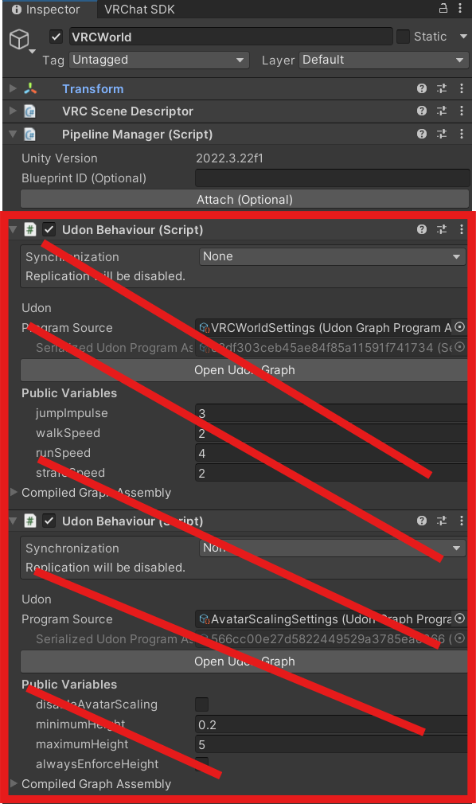
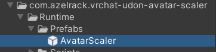
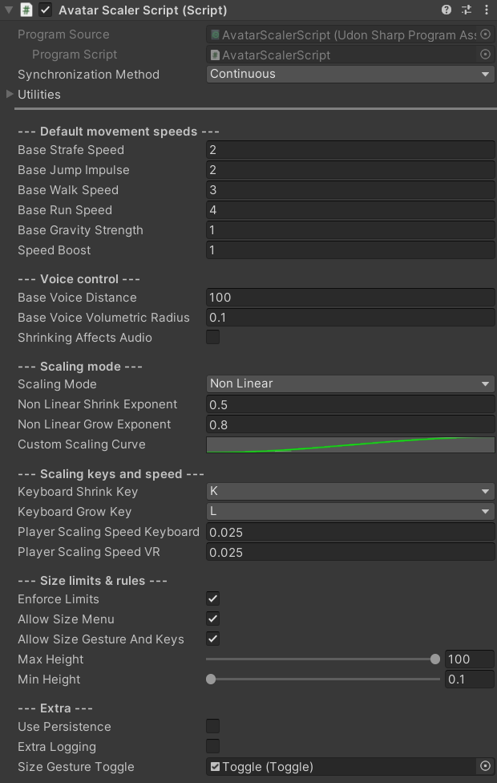
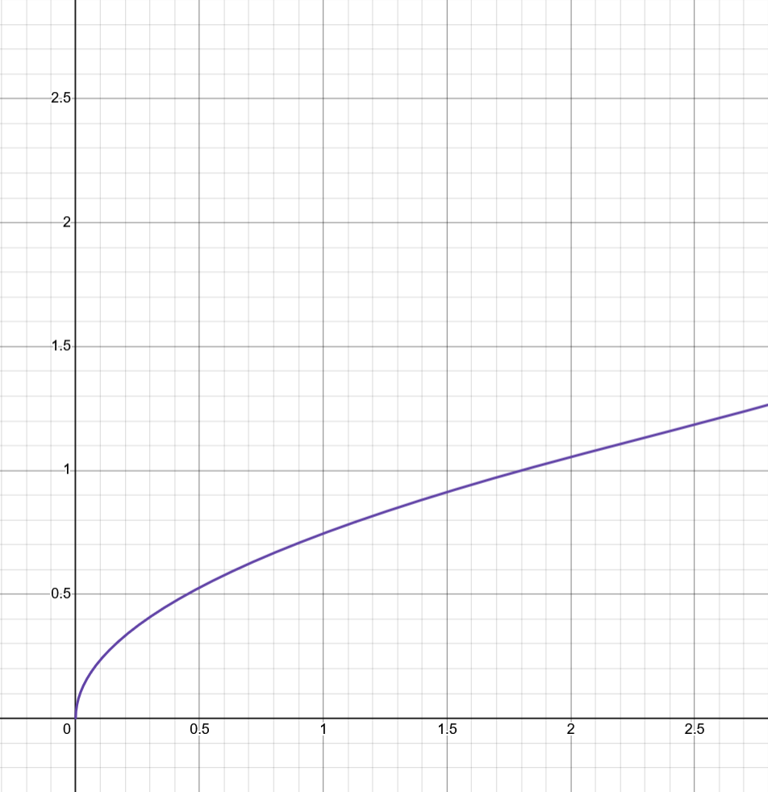
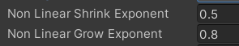
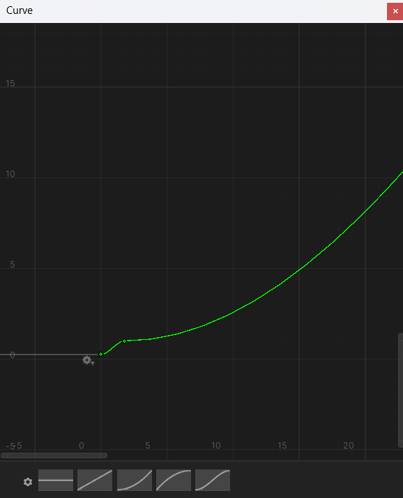
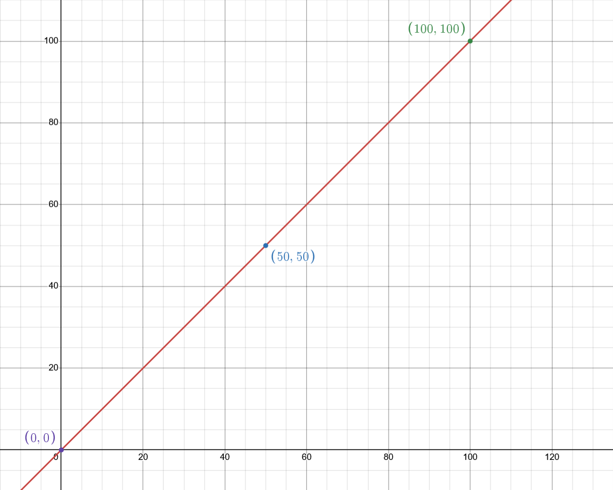

# Udon Avatar Scaler
All in one solution for VRChat worlds who wants size features.  
This script allows you to control how scale affects speed, gravity, voice and sound, and customise how deep the change is.  
Players can be given access to a gesture to quickly control their size.

There is a world where you can [try this system](https://vrchat.com/home/world/wrld_2b6b97de-02a0-48a0-9d28-287c34885c60).

# Planned updates
Check my [trello page](https://trello.com/b/ifE3GyiI/vrchat-udon-avatar-scaler) if you're interested in which features are planned for this asset.

# Installation
## Requirements
- Unity 2022.3.22f1
- VRChat world SDK 3.9.0 (should work starting 3.2.2 but untested, package will require 3.9).
## Steps
1. Add the [package](https://azelrack.github.io/VRChat-AzelVPMListing/) to VRChat Creator Companion. 
   - Alternatively you can download the latest release and import the .unitypackage in your project, before jumping to step 3.

2. In "Manage Project" beside your world project, add the VRChat Udon Avatar Scaler package.

3. Start your project and select the "VRCWorld" object in your scene hierarchy, and remove the existing scaling control scripts, as their features are included in the scaler and could collide.

4. Move the AvatarScaler prefab into your scene.

5. (Optionnal) Remove the objects in prefab hierarchy you don't want to use in your world.

6. Scaler is now installed and ready! Default values are the ones I use in my worlds. You might want to adjust the audio values depending on your world, it's impossible to have one setup that will fit every scenario, default values allows 100m tall players to hear 0.1m tall players.

# Scaling mode
When growing or shrinking, we often expects that our avatars gets affected by their new sizes, moving faster or slower for example. But when a player reduces ten times in size, if you reduce ten times their speed, they will feel extremely slow, which can be fun in some cases, but will often be frustrating, especially in hangout worlds. 

The scaling modes allows you to ajust how scale will affect the avatars, avoiding small players to be too slow, and big players to move too fast. 

To make calculation simple, we consider the base avatar size is 1.8m, this means any smaller or bigger avatar will be affected by scaling.

## Non linear scaling (recommended)

Will compress the scaling the more players gets away from the base size.  
Used to reduce the feeling of being too slow when shrinking, or too fast when growing.  

> Example: using default values, if you shrink to 0.1m, your size factor will be ~0.23, instead of ~0.05 in linear scaling.

This is my personal recommendation, default values should feel nice for your players.

Using 1 as a value means it will be linear.

## Custom curve

Uses Unity's AnimationCurve for precise, graphical setup of your own scaling.

> With great power comes great responsibility, be sure to create a valid curve to avoid surprises ingame.

## Linear scaling

The most simple scaling logic, if the avatar shrinks in half in size, he will be half as fast.  

Gameplay wise, this is not an enjoyable experience, as you can quickly feel very slow when shrinking.

# A word on testing
Scaler will work fine with client sim for your default player, but won't work for the additional players you will spawn.

To test on multiple players, you'll have to use the "Build and test your world" option in the VRChat SDK menu.
